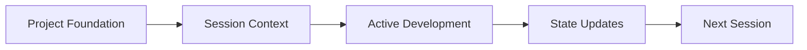

# Architecture Documentation

## System Overview

### Purpose

Provide a systematic approach to maintain context and manage project state in LLM-assisted development.

### Core Components

1. **Project Foundation Layer**

   - Immutable project documentation
   - Core requirements
   - Architectural decisions
   - Technical specifications

2. **Session Management Layer**

   - Context preparation
   - Progress tracking
   - Decision documentation
   - State updates

3. **State Tracking Layer**

   - Current project status
   - Feature implementation status
   - Active development tracking
   - Blocker management

4. **Technical Documentation Layer**

   - System architecture
   - Component specifications
   - API documentation
   - Data structures

5. **Process Management Layer**
   - Templates
   - Guidelines
   - Checklists
   - Best practices

## Information Architecture

### Data Flow



### Directory Structure

```
project_root/
├── 0_foundation/         # Project foundation
│   ├── project_overview.md
│   ├── requirements.md
│   ├── architecture.md
│   └── technical_stack.md
├── 1_sessions/          # Session management
│   ├── session_001/
│   │   ├── context.md
│   │   ├── objectives.md
│   │   ├── progress.md
│   │   └── next_steps.md
│   └── session_XXX/
├── 2_current_state/     # State tracking
│   ├── implemented_features.md
│   ├── active_development.md
│   ├── pending_tasks.md
│   └── blockers.md
├── 3_technical/         # Technical documentation
│   ├── architecture/
│   ├── components/
│   ├── data_structures/
│   └── apis/
└── 4_process/          # Process management
    ├── templates/
    ├── guidelines/
    └── checklists/
```

## Component Interactions

### Context Flow

1. **Foundation → Sessions**

   - Project requirements
   - Technical constraints
   - Architectural decisions

2. **Sessions → State**

   - Progress updates
   - Implementation status
   - Blocker identification

3. **State → Technical**

   - Feature implementation
   - API changes
   - Architecture updates

4. **Process → All Layers**
   - Documentation standards
   - Update procedures
   - Quality guidelines

## Implementation Guidelines

### Documentation Standards

- Markdown formatting
- Clear structure
- Version control friendly
- Self-contained sections

### Update Procedures

- Regular state updates
- Session documentation
- Technical documentation
- Process refinement

### Quality Assurance

- Documentation review
- Consistency checking
- Completeness verification
- Accuracy validation

## Future Extensibility

### Planned Expansions

1. **Automation Layer**

   - Context generation
   - State updates
   - Documentation validation

2. **Integration Layer**

   - CI/CD integration
   - Tool integration
   - Process automation

3. **Collaboration Layer**
   - Multi-user support
   - Role-based access
   - Review processes

## Architecture Decisions Record (ADR)

### ADR 001: Documentation Structure

- **Decision**: Hierarchical directory structure with clear separation of concerns
- **Context**: Need for organized and scalable documentation system
- **Consequences**: Easy navigation but requires discipline in maintenance

### ADR 002: File Format

- **Decision**: Markdown for all documentation
- **Context**: Need for version control friendly, easily readable format
- **Consequences**: Universal support but limited formatting options

### ADR 003: State Management

- **Decision**: Dedicated current state directory with specific focus files
- **Context**: Need for clear project status tracking
- **Consequences**: Clear status visibility but requires regular updates

## Security Considerations

### Documentation Security

- Access control through Git
- Sensitive information management
- Dependency documentation
- Security decision tracking

### Process Security

- Review procedures
- Update protocols
- Validation steps
- Access management

## Maintenance Guidelines

### Regular Maintenance

- Weekly state updates
- Monthly architecture review
- Quarterly process evaluation
- Continuous documentation updates

### Quality Control

- Documentation audits
- Consistency checks
- Completeness verification
- Accuracy validation
